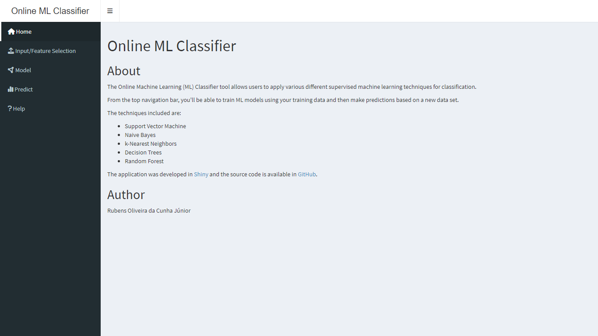

# online-ml-classifier

The Online Machine Learning (ML) Classifier tool allows users to apply various different supervised machine learning techniques for classification.
From the top navigation bar, you'll be able to train ML models using your training data and then make predictions based on a new data set.
The techniques included are:

- Support Vector Machine
- Naive Bayes
- k-Nearest Neighbors
- Decision Trees
- Random Forest

## Link

- Shinyapps: [https://rubensocj.shinyapps.io/online-ml-classifier/](https://rubensocj.shinyapps.io/online-ml-classifier/)
